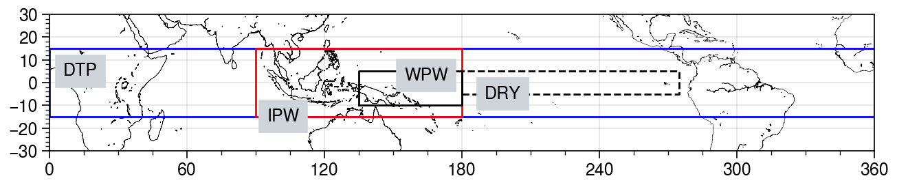
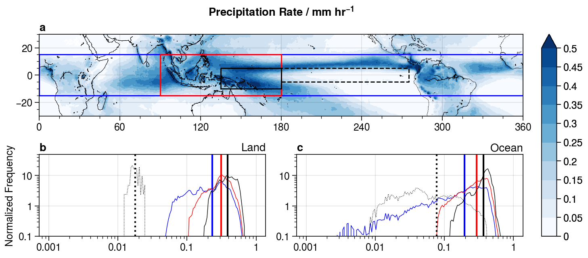
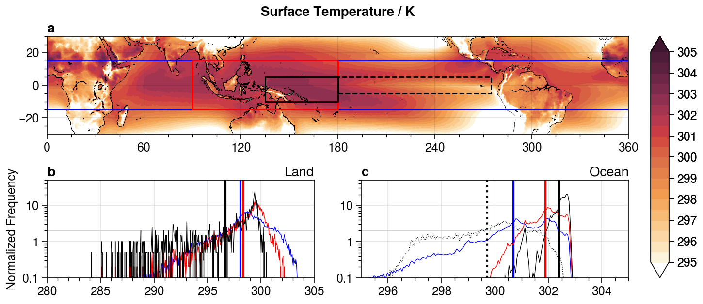

# **<div align="center">TropicalRCE</div>**

This repository contains the analysis scripts and output for the **TropicalRCE** project, written in Julia.  We aim to investigate how RCE simulations differ from the tropical atmosphere and why.

**Created/Mantained By:** Nathanael Wong (nathanaelwong@fas.harvard.edu)\
**Other Collaborators:** Zhiming Kuang (kuang@fas.harvard.edu)

> Introductory Text Here.

## Progress
* [ ] Download and analysis of ERA5 reanalysis Data
  * [x] Averaged surface data, binned by spatial distribution
  * [x] Profile of monthly-averaged pressure data against pressure-height
  * [ ] Averaged diurnal cycle for cloud-cover

* [ ] SAM Model Runs
  * [x] Basic RCE states for all domains
  * [ ] With large-scale vertical ascent derived from ERA5 climatology
  * [ ] Wind shear (?), to be decided

* [ ] SP-CAM analysis
  * [ ] Calculation of surface energy balance and comparison with ERA5

* [ ] SAM Model Analysis

## 0. Motivation

RCE simulations are often taken as an approximation to the tropical atmosphere.  However, from initial runs in the **[DiConv](https://github.com/natgeo-wong/DiConv)** project, we find that Cloud-Resolving RCE runs in the System of Atmospheric Modelling [(SAM)](http://rossby.msrc.sunysb.edu/~marat/SAM.html) v6.10.6, we find that the net energy balance at the surface is much greater than the tropical average O(40) W/m2.  The net energy balance in our runs at 302 K and equatorial insolation hovers at O(120) W/m2.  These results are not unique.  A recent study done by [Wing et al. (2020)](https://doi.org/10.1029/2020MS002138) as part of RCEMIP shows that for small domains (O(100)km in both horizontal directions), the mean surface energy balance is O(100) W/m2.

In a way, these results are somewhat expected, given that atmospheric transport out of the tropics is not accounted for in these small-domain CRMs.  However, even when accounting for large-scale vertical motion as a proxy for large-scale atmospheric motion and ascent in the tropics, the surface energy balance still hovers at O(120) W/m2.  Therefore, in this project, we aim to explore and understand the differences between our results in small-domain RCE simulations, and reanalysis data (ERA5) that acts as a proxy to observations.

## 1. Datasets Used

### A. Reanalysis Data

We used the following [ERA5](https://rmets.onlinelibrary.wiley.com/doi/full/10.1002/qj.3803) Reanalysis data from the Climate Data Store:
* Surface Fluxes: Net Solar, Net Longwave, Sensible and Latent
* TOA Fluxes: Net Solar, Net Longwave
* Cloud Cover: Total, High (0-450 hPa), Medium (450-800 hPa), High (800-1000 hPa)
* Temperature: 2m Air Temperature, Sea Surface, Pressure Lvl
* Total Column Water, Column Water Vapour
* Land-Sea Mask
* Vertical winds (by pressure level)

### B. Observational Data

We used [GPM IMERG](https://gpm.nasa.gov/data/directory) precipitation data from the PMM website, and ETOPO1 grid data.

### C. Model Data

#### I. System of Atmospheric Modelling (SAM)

In our project, we ran SAM v6.10.6 (w/ modifications by Dr. Peter Blossey) as a limited area CRM (64 x 64 x 64) with 2 km horizontal resolution in order to get the baseline RCE state for a variety of different combinations of:
* Fixed sea-surface temperature
* Insolation (averaged over domain latitudes)

Other notable configurations:
* 2-moment Morrison (2005) Microphysics
* Diurnal cycle on, perpetual spring equinox
* RRTM Radiation Scheme

#### II. Super-Parameterized Community Atmosphere Model (SP-CAM)

Our group maintains a version of the Community Atmosphere Model coupled to a 2D-domain of SAM run in CRM mode for the super-parameterization of convection in CAM, known as SP-CAM.  In order to see if the discrepancy in the our surface energy balance are due to the setup of our experiments, or artifact of SAM, we compare our results against runs in SP-CAM.  If the surface energy-balance in SP-CAM is similar to our results in pure RCE mode, then our results are likely an artifact of SAM.  However, if the surface energy balance is similar to that in reanalysis, then there is some aspect that is missing in our model setup that results in this energy imbalance.

Notable configurations:
* Perpetual February (spunup from average February climatology, Feb 15 insolation)

## 2. Domains

We considered the following domains in our analysis:
* **DTP (Deep Tropics):** 0-360ºE, 15ºS-15ºN
* **IPW (Indo-Pacific Warmpool):** 90-180ºE, 15ºS-15ºN
* **WPW (West Pacific Warmpool):** 135-180ºE, 10ºS-5ºN
* **DRY (Dry Pacific):** 180-275ºE, 5ºS-5ºN



These domains were chosen based on a combination of sea-surface temperature and precipitation characteristics.
* IPW and WPW domains have relatively high SST respect to the rest of the tropics (WPW more so and more localized than IPW)
* DRY domain has a relatively low SST despite equatorial insolation and very low precipitation




## 3. Model Runs Table

We ran SAM with the following SST and Insolation Configurations:

| Domain | Insol / W m**-2 | SST Range / K | Avg SST / K |
| :--:  |  :--:  | :--: | :--: |
|  DTP  | 1345.6 | 299-303, step 0.5 | 300.8 |
|  WPW  | 1355.8 | 301-303, step 0.5 | 302.4 |
|  DRY  | 1359.3 | 297-302, step 0.5 | 299.7 |

**DTP Domain Analogues:**

## 4. Surface Energy Balance

### Radiative-Convective Equilibrium in SAM

Text

### Comparison with ERA5 Reanalysis

We find that the surface energy balance in ERA5 Reanalysis

## Installation

To (locally) reproduce this project, do the following:

0. Download this code base. Notice that raw data are typically not included in the
   git-history and may need to be downloaded independently.
1. Open a Julia console and do:
   ```
   julia> ] activate .
    Activating environment at `~/Projects/TropicalRCE/Project.toml`

   (TropicalRCE) pkg> instantiate
   (TropicalRCE) pkg> add GeoRegions#master SAMTools#master
   ```

This will install all necessary packages for you to be able to run the scripts and
everything should work out of the box.

*(Note: You need to install the #master versions of GeoRegions.jl and SAMTools.jl as of now.)*

## **Other Acknowledgements**
> Project Repository Template generated using [DrWatson.jl](https://github.com/JuliaDynamics/DrWatson.jl) created by George Datseris.
