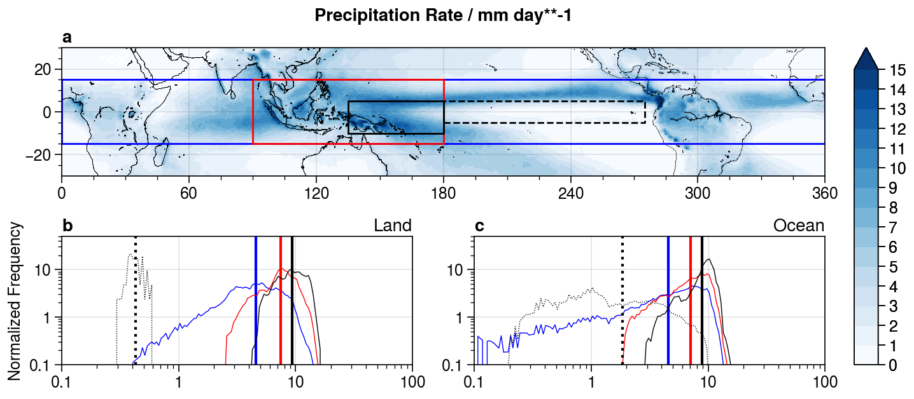
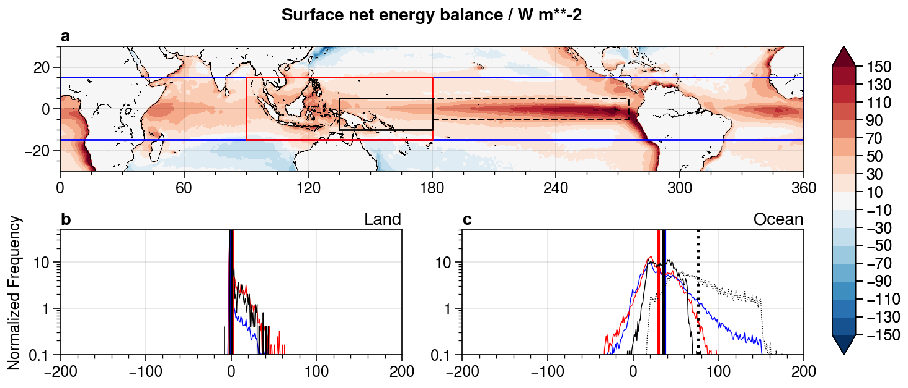

# **<div align="center">TropicalRCE</div>**

This repository contains the analysis scripts and output for the **TropicalRCE** project, written in Julia.  We aim to investigate how RCE simulations differ from the tropical atmosphere and why.

**Created/Mantained By:** Nathanael Wong (nathanaelwong@fas.harvard.edu)\
**Other Collaborators:** Zhiming Kuang (kuang@fas.harvard.edu)

> Introductory Text Here.

## Progress
* [ ] Download and analysis of ERA5 reanalysis Data
   * [x] Averaged surface data, binned by spatial distribution
   * [x] Profile of monthly-averaged pressure data against pressure-height
   * [ ] Averaged diurnal cycle for cloud-cover

* [ ] SAM Model Runs
   * [x] 1-Moment Microphysics Basic RCE states for all domains
   * [x] 2-Moment Microphysics Basic RCE states for all domains
   * [ ] With large-scale vertical ascent derived from ERA5 climatology
   * [ ] Wind shear (?), to be decided

* [x] SP-CAM analysis
   * [x] Calculation of surface energy balance and comparison with ERA5

* [ ] SAM Model Analysis

## 0. Motivation

RCE simulations are often taken as an approximation to the tropical atmosphere.  However, from initial runs iof SAM in Radiative-Convective Equilibrium (RCE) Cloud-Resolving Mode (CRM), we find that cloud-resolving RCE runs in the System of Atmospheric Modelling [(SAM)](http://rossby.msrc.sunysb.edu/~marat/SAM.html) v6.10.6 have a net energy balance at the surface is much greater than the tropical average O(40) W/m2.  The net energy balance in our runs at 302 K and equatorial insolation hovers at O(120) W/m2.  These results are not unique.  A recent study done by [Wing et al. (2020)](https://doi.org/10.1029/2020MS002138) as part of RCEMIP shows that for small domains (O(100)km in both horizontal directions), the mean surface energy balance is O(100) W/m2.

In a way, these results are somewhat expected, given that atmospheric transport out of the tropics is not accounted for in these small-domain CRMs.  However, even when accounting for large-scale vertical motion as a proxy for large-scale atmospheric motion and ascent in the tropics, the surface energy balance still hovers at O(120) W/m2.  Therefore, in this project, we aim to explore and understand the differences between our results in small-domain RCE simulations, and reanalysis data (ERA5) that acts as a proxy to observations.

## 1. Datasets Used

### A. Reanalysis Data

We used the following [ERA5](https://rmets.onlinelibrary.wiley.com/doi/full/10.1002/qj.3803) Reanalysis data from the Climate Data Store:
* Surface Fluxes: Net Solar, Net Longwave, Sensible and Latent
* TOA Fluxes: Net Solar, Net Longwave
* Cloud Cover: Total, High (0-450 hPa), Medium (450-800 hPa), High (800-1000 hPa)
* Temperature: 2m Air Temperature, Sea Surface, Pressure Lvl
* Total Column Water, Column Water Vapour
* Land-Sea Mask
* Vertical winds (by pressure level)

### B. Observational Data

We used [GPM IMERG](https://gpm.nasa.gov/data/directory) precipitation data from the PMM website, and ETOPO1 grid data.

### C. Model Data

#### I. System of Atmospheric Modelling (SAM)

In our project, we ran SAM v6.10.6 (w/ modifications by Dr. Peter Blossey) as a limited area CRM (64 x 64 x 64) with 2 km horizontal resolution in order to get the baseline RCE state for a variety of different combinations of:
* Fixed sea-surface temperature
* Insolation (averaged over domain latitudes)

Other notable configurations:
* 1/2-moment Microphysics (SAM1MOM and M2005 options in SAM)
* Diurnal cycle on, perpetual spring equinox
* RRTM Radiation Scheme

#### II. Super-Parameterized Community Atmosphere Model (SP-CAM)

Our group maintains a version of the Community Atmosphere Model coupled to a 2D-domain of SAM run in CRM mode for the super-parameterization of convection in CAM, known as SP-CAM.  In order to see if the discrepancy in the our surface energy balance are due to the setup of our experiments, or artifact of SAM, we compare our results against runs in SP-CAM:
* If the surface energy-balance in SP-CAM is similar to our results in pure RCE mode, then our results are likely an artifact of an error in SAM
* If the surface energy balance is similar to that in reanalysis, then there is some aspect that is missing in our model setup that results in this energy imbalance.

Notable configurations:
* Perpetual February (spunup from average February climatology, Feb 15 insolation)

## 2. Domains

We considered the following domains in our analysis:
* **DTP (Deep Tropics):** 0-360ºE, 15ºS-15ºN
* **IPW (Indo-Pacific Warmpool):** 90-180ºE, 15ºS-15ºN
* **WPW (West Pacific Warmpool):** 135-180ºE, 10ºS-5ºN
* **DRY (Dry Pacific):** 180-275ºE, 5ºS-5ºN


These domains were chosen based on a combination of sea-surface temperature and precipitation characteristics.
* **IPW** and **WPW** domains have relatively **high SST** compared to the rest of the tropics (WPW more so and more localized than IPW)
* **DRY** domain has a relatively **low SST** despite equatorial insolation and very **low precipitation**




## 3. Model Runs Table

We ran SAM with the following SST and Insolation Configurations:

| Domain | Insol / W m**-2 | SST Range / K | Avg SST / K | Microphysics |
| :---: |  :--:  | :-----------------: | :---: | :----------: |
|  DTP  | 1345.6 |  299-303, step 0.5  | 300.7 | SAM1MOM (1M) |
|  IPW  | 1345.6 | 300.5-303, step 0.5 | 301.9 | SAM1MOM (1M) |
|  WPW  | 1355.8 |  301-303, step 0.5  | 302.4 | SAM1MOM (1M) |
|  DRY  | 1359.3 |  297-302, step 0.5  | 299.7 | SAM1MOM (1M) |
|  DTP  | 1345.6 |  299-303, step 0.5  | 300.7 |  M2005 (2M)  |
|  IPW  | 1345.6 | 300.5-303, step 0.5 | 301.9 |  M2005 (2M)  |
|  WPW  | 1355.8 |  301-303, step 0.5  | 302.4 |  M2005 (2M)  |
|  DRY  | 1359.3 |  297-302, step 0.5  | 299.7 |  M2005 (2M)  |

We conducted three batches of the above experiments:
1. RCE in 3D, 64x64 horizontal grid at 2 km resolution, 64 vertical levels (3D)
2. RCE in 2D, 64 horizontal points at 2 km resolution, 64 vertical levels (2D)
3. RCE in 2D, 512 horizontal points at 0.5 km resolution, 64 vertical levels (2DH)

## 4. Comparison of SAM Runs against Reanalysis and Observation Data

### A. Surface Variables

**Precipitation / mm/day**
| Domain | Insol | SST / K | GPM | ERA5 | 3D-1M | 3D-2M | 2D-1M | 2D-2M | 2DH-1M | 2DH-2M |
| :-: | :----: | :---: | :--: | :--: | :--: | :--: | :--: | :--: | :--: | :--: |
| DTP | 1345.6 | 300.7 | 4.70 | 4.70 | 3.05 | 2.64 | 3.17 | 2.67 | 2.97 | 2.60 |
| IPW | 1345.6 | 301.9 | 7.05 | 6.53 | 3.22 | 2.80 | 3.33 | 2.82 | 3.01 | 2.71 |
| WPW | 1355.8 | 302.4 | 8.90 | 7.98 | 3.26 | 2.86 | 3.34 | 2.83 | 3.11 | 2.81 |
| DRY | 1359.3 | 299.7 | 1.86 | 2.61 | 2.91 | 2.49 | 3.05 | 2.50 | 2.73 | 2.45 |

*(Note: We plot the ERA5 precipitation below:)*


It is interesting to see that the ERA5 domain mean precipitation over the deep tropics as a whole is almost exactly the same as that given by the GPM IMERG dataset.  However, on a smaller domain scale, such as over the WPW or DRY domains, differences remain.  We do note that the ERA5 precipitation in the DRY region is very similar to that from our RCE runs, though the significance of this is as of yet unclear (caa 28 Oct 2020).

**Total Column Water / mm**
| Domain | Insol | SST / K | ERA5  | 3D-1M | 3D-2M | 2D-1M | 2D-2M | 2DH-1M | 2DH-2M |
| :-: | :----: | :---: | :---: | :---: | :---: | :---: | :---: | :---: | :---: |
| DTP | 1345.6 | 300.7 | 42.78 | 40.66 | 43.20 | 39.73 | 43.47 | 42.78 | 44.13 |
| IPW | 1345.6 | 301.9 | 49.05 | 45.30 | 47.80 | 44.50 | 47.87 | 49.14 | 49.52 |
| WPW | 1355.8 | 302.4 | 52.15 | 47.57 | 50.01 | 47.04 | 50.65 | 51.37 | 51.51 |
| DRY | 1359.3 | 299.7 | 40.69 | 37.15 | 39.95 | 35.91 | 39.87 | 40.64 | 40.40 |

Right off the bat, we see that 2-moment microphysics simulations have a higher overall precipitable water in the atmosphere compared to 1-moment microphysics.  However, this does **not** correspond to higher rainfall.  Indeed, precipitation actually falls in simulations with 2-moment microphysics despite there being higher overall column water.  Furthermore, we see that at the same horizontal resolution, 2D simulations have higher rainfall than 3D simulations, but as the resolution of the simulations increases, rainfall rate decreases.

### B. Atmospheric Temperature

Text

### C. Specific Humidity Profile

### D. Relative Humidity Profile

### E. Cloud Fraction Profile

## 5. Surface Energy Balance

### A. Radiative-Convective Equilibrium in SAM

Here, I display a summary of the surface energy balance for the model runs in SAM with averaged SST for each ERA5 domain.  A full table containing all the experiments will be provided elsewhere.

| Domain | Insol  | SST / K | Config | Net SW | Net LW | Sensible | Latent | SFC Bal |
| :-: | :----: | :---: | :----: | :-----: | :----: | :----: | :----: | :-----: |
| DTP | 1345.6 | 300.7 | 3D-1M  | +280.89 | -68.66 | -10.66 | -88.59 | +112.98 |
| IPW | 1345.6 | 301.9 | 3D-1M  | +279.96 | -64.29 | -10.41 | -93.23 | +112.03 |
| WPW | 1355.8 | 302.4 | 3D-1M  | +281.43 | -62.22 | -10.20 | -94.83 | +114.18 |
| DRY | 1359.3 | 299.7 | 3D-1M  | +285.66 | -72.13 | -10.75 | -84.62 | +118.17 |
| DTP | 1345.6 | 300.7 | 3D-2M  | +271.18 | -64.21 | -6.67  | -76.66 | +123.65 |
| IPW | 1345.6 | 301.9 | 3D-2M  | +270.28 | -60.38 | -6.57  | -81.30 | +122.03 |
| WPW | 1355.8 | 302.4 | 3D-2M  | +272.64 | -58.61 | -6.47  | -83.23 | +124.33 |
| DRY | 1359.3 | 299.7 | 3D-2M  | +274.36 | -66.87 | -6.62  | -72.27 | +128.60 |

We see overall that the energy balance of small-domain RCE simulations in SAM have an overall surface energy balance of ~O(120) W/m2, compared to typical values of about 0-40 W/m2 (see comparison with reanalysis data below), and this is largely due to the very high net shortwave radiation into the ocean, which is only partially compensated by slightly increased net longwave radiation upward.

| Domain | Insol  | SST / K | Config | Net SW | Net LW | Sensible | Latent | SFC Bal |
| :-: | :----: | :---: | :----: | :-----: | :----: | :----: | :----: | :-----: |
| DTP | 1345.6 | 300.7 | 2D-1M  | +274.42 | -67.25 | -10.33 | -91.04 | +105.81 |
| IPW | 1345.6 | 301.9 | 2D-1M  | +274.81 | -62.49 | -10.17 | -96.58 | +105.57 |
| WPW | 1355.8 | 302.4 | 2D-1M  | +278.70 | -60.24 | -9.89  | -97.53 | +111.04 |
| DRY | 1359.3 | 299.7 | 2D-1M  | +279.28 | -71.22 | -10.72 | -88.70 | +108.64 |
| DTP | 1345.6 | 300.7 | 2D-2M  | +257.07 | -60.02 | -6.04  | -76.93 | +114.09 |
| IPW | 1345.6 | 301.9 | 2D-2M  | +258.70 | -56.98 | -5.98  | -82.24 | +113.50 |
| WPW | 1355.8 | 302.4 | 2D-2M  | +257.60 | -53.90 | -5.72  | -82.50 | +115.48 |
| DRY | 1359.3 | 299.7 | 2D-2M  | +260.03 | -63.37 | -6.06  | -72.60 | +118.00 |

| Domain | Insol  | SST / K | Config | Net SW | Net LW | Sensible | Latent | SFC Bal |
| :-: | :----: | :---: | :----: | :-----: | :----: | :----: | :----: | :-----: |
| DTP | 1345.6 | 300.7 | 2DH-1M | +264.99 | -63.64 | -10.45 | -87.70 | +103.20 |
| IPW | 1345.6 | 301.9 | 2DH-1M | +262.44 | -57.07 | -9.50  | -88.37 | +107.50 |
| WPW | 1355.8 | 302.4 | 2DH-1M | +262.14 | -55.56 | -9.46  | -90.57 | +106.55 |
| DRY | 1359.3 | 299.7 | 2DH-1M | +263.22 | -63.68 | -10.13 | -80.20 | +109.21 |
| DTP | 1345.6 | 300.7 | 2DH-2M | +258.88 | -59.62 | -6.53  | -75.37 | +117.35 |
| IPW | 1345.6 | 301.9 | 2DH-2M | +256.48 | -54.87 | -6.34  | -78.75 | +116.52 |
| WPW | 1355.8 | 302.4 | 2DH-2M | +258.27 | -53.63 | -6.30  | -81.87 | +116.47 |
| DRY | 1359.3 | 299.7 | 2DH-2M | +260.99 | -62.90 | -6.58  | -71.42 | +120.10 |

A comparison between 3D and 2D simulations shows us that for 2D simulations, the surface energy imbalance is slightly lower, though much higher than observations, at ~O(110) W/m2 on average.  There appears to be no significant difference between simulations of the original size, and simulations that are larger in area and higher in resolution.

Something that is consistent among all simulations is that when 1-moment microphysics is switched to 2-moment microphysics, the **Shortwave** fluxes decrease in magnitude.  However, at the same time the **Sensible** and **Latent** Heat fluxes decrease in magnitude.  Therefore, even though less shortwave reaches the surface, the net change in sensible and latent heat fluxes are such that the surface imbalance in 2-moment microphysics actually increases by about 10% compared to 1-moment microphysics.

### B. Comparison with ERA5 Reanalysis

We find that the surface energy balance in ERA5 reanalysis is much lower than that in our SAM model runs.



| Domain | Insol  | SST / K | Net SW | Net LW | Sensible | Latent | SFC Bal |
| :----: |  :---: |  :---:  |  :---:  |  :--:  | :----: |  :---:  |  :--:  |
|  DTP   | 1345.6 |  300.7  | +178.84 | -42.92 | -8.96  | -105.60 | +29.86 |
|  IPW   | 1345.6 |  301.9  | +174.08 | -40.79 | -9.46  | -100.09 | +23.83 |
|  WPW   | 1355.8 |  302.4  | +172.56 | -39.74 | -10.26 | -94.14  | +28.45 |
|  DRY   | 1359.3 |  299.7  | +191.51 | -41.38 | -5.85  | -83.15  | +61.14 |

### C. Comparison with SP-CAM

As mentioned in Section 2, we also compare our results to that from SP-CAM in order to determine if the anomalously high surface imbalances we see in our SAM model runs are an artifact of our experiments being RCE runs (and therefore other aspects that must be included for the energy imbalance to be more realistic), or if this is a problem with SAM.


| Domain | Insol  | SST / K | Net SW | Net LW | Sensible | Latent | SFC Bal |
| :----: |  :---: |  :---:  |  :---:  |  :--:  | :---:  |  :--:   |  :--:  |
|  DTP   | 1345.6 |  300.7  | +202.43 | -48.83 | -10.93 | -137.01 | +5.65  |
|  IPW   | 1345.6 |  301.9  | +183.81 | -45.70 | -12.77 | -149.11 | -23.77 |
|  WPW   | 1355.8 |  302.4  | +180.08 | -40.93 | -11.29 | -132.38 | -4.52  |
|  DRY   | 1359.3 |  299.7  | +224.75 | -44.15 | -5.03  | -90.69  | +84.88 |

We see from the SP-CAM runs that the surface energy balance within the tropics is definitely not as high as in our SP-CAM runs.  The magnitude of the surface energy balance in the tropics and the net shortwave downwards into the ground at ~O(190) W/m2 which is close to that of reanalysis, indicates that the very high net shortwave ~O(280) W/m2 observed in small-domain RCE simulations is due to the RCE setup itself, rather that it being an artifact of SAM.

It is notable however, that in our SP-CAM runs the surface energy balance of the tropical regions is negative.  However, this is likely due to the fact that the SP-CAM model was run in a perpetual mid-February insolation, which is not equinoctal, and where there is more insolation in the southern hemisphere that would account for an overall loss in surface energy balance in many tropical regions.  In fact, we do see a gradient in the surface energy balance from north to south.

## 6. Finding the Underlying Reason for Large Surface Imbalances in RCE

### A. Large-scale Circulation

Text

### B. Imposing a Weak Temperature Gradient

Text

### C. The Diurnal Cycle of Cloud Cover

Text

### D. Wind Shear

Text

## Installation

To (locally) reproduce this project, do the following:

0. Download this code base. Notice that raw data are typically not included in the
   git-history and may need to be downloaded independently.
1. Open a Julia console and do:
   ```
   julia> ] activate .
    Activating environment at `~/Projects/TropicalRCE/Project.toml`

   (TropicalRCE) pkg> instantiate
   (TropicalRCE) pkg> add GeoRegions#master SAMTools#master
   ```

This will install all necessary packages for you to be able to run the scripts and
everything should work out of the box.

*(Note: You need to install the #master versions of GeoRegions.jl and SAMTools.jl as of now.)*

## **Other Acknowledgements**
> Project Repository Template generated using [DrWatson.jl](https://github.com/JuliaDynamics/DrWatson.jl) created by George Datseris.
